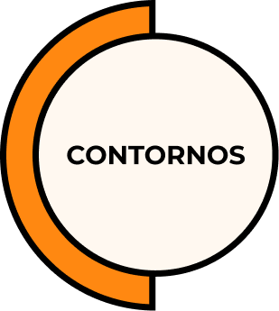

	
<h1 id="cover-heading">
Contornos<small>0.7.2</small>
</h1>

>  Tecnologia Social para Organizações

## Princípios do sistema
- :cyclone: Levar em conta o sistema organizacional e os fluxos de valor.
- :loop: Amplificar 'loops de feedback'.
- :zap: Experimentar e aprender continuamente. 
- :high_brightness: Descentralizar decisões. 
- :loudspeaker: Disponibilizar e tornar compreensíveis as informações.
- :thumbsup: Tudo é permitido desde que não seja explicitamente proibido.
