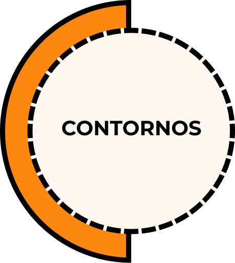

# Sistema [Contornos] - [Versão: 0.7.2]

[Contornos] é um sistema contendo regras básicas que cuida de aspectos organizacionais para distribuição de decisões e adaptação organizacional contínua que fomentem mais experimentações para dentro, para e com o público interno, e para fora, para e com o público externo.

Ele torna desnecessário:
- organogramas hierárquicos e rígidos onde pessoas têm **poder sobre** as outras
- cargos que se tornam pesados e difíceis para manter e adaptar

Neste sistema, há uma hierarquia de escopos através de contornos, onde pessoas têm **poder com** as outras em uma gestão distribuída.

Pense nisso como um sistema operacional enxuto 'open-source' (código aberto), que permite você importar [apps](https://github.com/renatoac/contornos/wiki/apps) (acordos extras pré-definidos) para o seu contexto, além de adaptar o próprio sistema, se necessário.

[Contornos] foi inspirado em [tecnologias sociais validadas](https://github.com/renatoac/contornos/wiki/Compara%C3%A7%C3%A3o-entre-tecnologias-sociais), outros conceitos existentes e experiência prática.

Vale lembrar que essa tecnologia social, ou qualquer outra, não funciona como mágica, que ao usar tudo se resolve. Não, longe disso. 
Ela é apenas uma ferramenta e um meio, como tantos outros, que faz sentido quando usada em conjunto com outras ferramentas e práticas, apoiadas por muitas discussões interpessoais e experimentos contínuos. 

---
### Mais informações
- [Apps](https://github.com/renatoac/contornos/wiki/Apps) - biblioteca de acordos extras pré-definidos para implementar no sistema [Contornos].
- [Curiosidades](https://github.com/renatoac/contornos/wiki/curiosidades)
- [Perguntas & Respostas](https://github.com/renatoac/contornos/wiki/perguntas-&-respostas)
  - [Como iniciar com o sistema Contornos?](https://github.com/renatoac/contornos/wiki/Perguntas-&-Respostas#como-iniciar-com-o-sistema-contornos)
  - [Como medir o impacto de mudanças no design organizacional?](https://github.com/renatoac/contornos/wiki/Perguntas-&-Respostas#como-medir-o-impacto-de-mudan%C3%A7as-no-design-organizacional)
  - e muitas outras.
- [Referências](https://github.com/renatoac/contornos/wiki/refer%C3%AAncias)
- [Comparação entre tecnologias sociais](https://github.com/renatoac/contornos/wiki/Compara%C3%A7%C3%A3o-entre-tecnologias-sociais): Organizações Orgânicas (O2), Sociocracy For All, Sociocracia 3.0 e Holacracia.
- [Ferramentas digitais](https://github.com/renatoac/contornos/wiki/Ferramentas-digitais) para apoiar no uso do sistema Contornos
  - Você pode experimentar um [modelo básico para aplicação de [Contornos] configurado na ferramenta Fibery.io](https://github.com/renatoac/contornos/wiki/Ferramentas-digitais).

---

### Contato e fase experimental
Até então, este sistema é desenvolvido e mantido por [Cali (Renato Caliari)](https://www.linkedin.com/in/renatocaliari/). Você pode entrar em contato pelo site: [renatocaliari.com](https://renatocaliari.com/). 

O sistema está em constante adaptação e refinamento nessa fase experimental. 

---

### Índice
- [0. Princípios](#0-princípios)
- [1. Estrutura organizacional](#1-estrutura-organizacional)
- [2. Contornos](#2-contornos)
  * [2.1. Quando criar novos contornos?](#21-quando-criar-novos-contornos)
  * [2.2. Como adaptar ou remover um contorno?](#22-como-adaptar-ou-remover-um-contorno)
- [3. Participação em contornos](#3-participação-em-contornos)
  * [3.1. Papéis estruturais](#31-papéis-estruturais)
    * [3.1.1. Guardiã do contorno](#311-guardiã-do-contorno)
    * [3.1.2. Agente do contorno](#312-agente-do-contorno)
  * [3.2. Alocação de pessoas em contornos](#32-alocação-de-pessoas-em-contornos)
    * [3.2.1. Alocação de guardiã e agente](#321-alocação-de-guardiãs-e-agentes)
    * [3.2.2. Cuidado com foco e tempo](#322-cuidado-com-foco-e-tempo)
    * [3.2.3. Reavaliação de alocação](#323-reavalia%C3%A7%C3%A3o-de-aloca%C3%A7%C3%A3o)
    * [3.2.3. Retirada de pessoas de contornos](#325-retirada-de-pessoas-de-contornos)
- [4. Atributos dos contornos](#4-atributos-dos-contornos)
  * [4.1. Nome do escopo](#41-nome-do-escopo)
  * [4.2. Apelido](#42-apelido)
  * [4.3. Razão de existir (’Por quê?’)](#43-razão-de-existir-por-quê)
  * [4.4. Responsabilidades (’Como?’)](#44-responsabilidades-como)
    * [4.4.1. Decisões operacionais](#441-decisões-operacionais)
  * [4.5. Estratégia (’Como?’)](#45-estratégia-como)
  * [4.6. Processo (’Como?’)](#46-processo-como)
  * [4.7. Elementos de controle exclusivo (’Como?’)](#47-elementos-de-controle-exclusivo-como)
  * [4.8. Projetos (’O quê?’)](#48-projetos-o-quê)
    * [4.8.1. Pedido por projetos ou tarefas](#481-pedido-por-projetos-ou-tarefas)
  * [4.9. Acordos](#49-acordos)
    * [4.9.1. Acordos estruturais](#491-acordos-estruturais)
    * [4.9.2. Acordos pessoais](#492-acordos-pessoais)
  * [4.10. Indicadores de saúde e resultado](#410-indicadores-de-saúde-e-resultado)
- [5. Quem define os atributos?](#5-quem-define-os-atributos)
- [6. Impulsionadores](#6-impulsionadores)
- [7. Decisão integrativa](#7-decisão-integrativa)
  - [7.1. Decisão integrativa assíncrona](#71-decisão-integrativa-assíncrona)
- [8. Ação extraordinária](#8-ação-extraordinária)

---

# 0. Princípios
- Levar em conta o sistema organizacional como um todo e os fluxos de valor.
- Amplificar 'loops de feedback'.
- Experimentar e aprender continuamente. 
- Descentralizar decisões. 
  - Quando for necessário decidir em mais de uma pessoa, decidir em poucas pessoas que representem os escopos impactados.
  - Pessoas que participam das decisões também sofrem o impacto das decisões.
  - Considerar informações das pessoas impactadas que não participam das decisões antes de tomar decisões.
  - Colher reações das pessoas impactadas que não participam das decisões depois de tomar decisões.
- Disponibilizar e tornar compreensível as informações para todas as pessoas que precisam ou podem se beneficiar dessas informações.
- Tudo é permitido desde que não seja explicitamente proibido.

# 1. Estrutura organizacional
A estrutura organizacional é definida por contornos. As pessoas parceiras da organização trabalham orientadas por esses contornos, uma hierarquia de especificidade e não de pessoas. 

O sistema começa com a máxima de que _“tudo é permitido desde que não seja explicitamente proibido”_ em algum [acordo](#47-acordos) contendo restrição ou definido como [elementos de controle exclusivo](#45-elementos-de-controle-exclusivo-como) de algum contorno em vez do inverso comum em muitas organizações de que _“tudo é proibido desde que seja explicitamente permitido”_. 

[Veja um exemplo de uma estrutura de contornos nas Perguntas & Respostas](https://github.com/renatocaliari/contornos/wiki/Perguntas-&-Respostas#exemplo-de-estrutura-de-contornos).

# 2. Contornos
Contorno é um escopo delimitado por razão de existir, responsabilidades, elementos de controle exclusivo e acordos próprios.
Um contorno evita decidir a todo momento o que é necessário fazer e quem fará algo.

Cada contorno governa a sua própria estrutura, que pode ser alterada pela guardiã do contorno ou por decisão integrativa dependendo do contexto.

Uma pessoa pode estar em vários contornos e um contorno pode conter várias pessoas.

## 2.1 Quando criar novos contornos?
Crie contornos quando: 
- perceber alguns padrões recorrentes para potencializar eficácia e compreensão compartilhada.
- desejar delegar parte das responsabilidades e elementos de controle exclusivo.

Regras simples: 
- desenhe novos contornos a partir de demandas do público, interno ou externo.
- minimize a criação de contornos que dependam de entregas recorrentes, previstas e necessárias entre eles (_handover_ ou _handoff_) que não estejam dentro de um mesmo contorno externo. 

Uma forma que pode ajudar descobrir a necessidade de contornos internos é mapear um [processo existente ou necessário no contorno](#44-processo-como) e observar quais etapas não possuem contornos responsáveis.

## 2.2 Como adaptar ou remover um contorno?
A qualquer momento que alguém perceber que um contorno precisa, ou é desejável, ser adaptado, seja qual for o atributo, ou que não tem mais uma razão de existir, uma proposta pode ser feita para a realização dessa alteração ou remoção do contorno.

Para remoção de um contorno, é necessário decisão integrativa pelo contorno externo, podendo decidir quais contornos internos ao contorno sendo excluído desejam trazer para o contorno que está tomando a decisão.

Para adaptação do contorno, é necessário identificar qual é o atributo e quem tem autoridade para adaptá-lo.

# 3. Participação em contornos
A participação em contornos acontece por meio de alocação de pessoas em um dos dois papéis estruturais: guardiã ou agente.

Necessariamente, todo contorno terá uma guardiã.

É possível indicar o [tipo de energia](https://github.com/renatoac/contornos/wiki/Apps#tipo-de-energia-em-contorno) que cada participante terá em um determinado contorno.

Qualquer participante de um contorno possui essas **responsabilidades em comum**:
* perceber e tratar [impulsionadores](#6-impulsionadores) de seu contorno.
* priorizar projetos e tarefas de acordo com razão de existir e estratégia dos contornos em que participa. 
* compartilhar qualquer informação relacionada ao seu contorno ー projetos, tarefas, etc ー quando alguém perguntar, exceto se algo for acordado como confidencial.
* realizar o que for necessário para expressar a razão de existir e estratégia de seus contornos, respeitando [acordos](#47-acordos), [estratégia](#43-estrat%C3%A9gia-como), [processo](#44-processo-como) e [elementos de controle exclusivo](#45-elementos-de-controle-exclusivo-como).
* quando for necessário ou oportuno, realizar o que for necessário para expressar a razão de existir e estratégia dos contornos da organização que não participa, respeitando [acordos](#47-acordos), [estratégia](#43-estrat%C3%A9gia-como), [processo](#44-processo-como) e [elementos de controle exclusivo](#45-elementos-de-controle-exclusivo-como).
  * para essa responsabilidade, levar em conta essas regras:
    * considere o contexto e informações disponíveis da estrutura atual e do risco ou oportunidade.
    * faça o melhor julgamento possível com o que tem à disposição. 
    * realize as ações que considere adequadas.

## 3.1 Papéis estruturais
Há dois papéis estruturais básicos em Contornos: guardiã e agente.

Além desses dois papéis estruturais, é possível instalar [papéis estruturais extras](https://github.com/renatoac/contornos/wiki/Apps#pap%C3%A9is-estruturais-extras), como: Representante, Sinapse, Facilitadora e Secretária.

### 3.1.1 Guardiã do contorno

#### Razão de existir
  * guardar o espaço do contorno e responder pela razão de existir do mesmo.

#### Participação
  * toda guardiã de um contorno também é participante do contorno externo como [agente](https://github.com/renatoac/contornos/wiki#312-agente-do-contorno).

#### Responsabilidades
  * _todas responsabilidades gerais de participantes de contorno_.
  * _todas responsabilidades do próprio contorno_ que não estejam delegadas a contornos internos.
  * trazer informações do contorno externo para todas participantes do seu contorno.
  * tomar ação sobre contornos sem participantes: convidar pessoas para eles ou remover o contorno, com decisão integrativa.
  * agir sobre impulsionadores sem progressão no contorno.
  * propôr estratégia do contorno, precisando de decisão integrativa.
  * propôr processo do contorno, precisando de decisão integrativa.
  * propôr pessoas para apoiar o contorno.
  * compartilhar indicadores com o contorno externo, na frequência sugerida pelo contorno externo.
  * compartilhar sobre o progresso dos projetos com o contorno externo, na frequência sugerida pelo contorno externo, informando como isso se conecta à estratégia e propósito do contorno externo.

#### Responsabilidades da guardiã do maior contorno, a organização em si
  * _todas responsabilidades gerais de participantes de contorno_.
  * _todas responsabilidades do próprio contorno_ que não estejam delegadas a contornos internos.
  * tomar ação sobre contornos sem participantes: convidar pessoas para eles ou remover o contorno, com decisão integrativa.
  * agir sobre impulsionadores sem progressão no contorno.
  * propôr estratégia do contorno, precisando de decisão integrativa.
  * propôr processo do contorno, precisando de decisão integrativa.
  * propôr pessoas para apoiar o contorno.
  * compartilhar indicadores com a organização, na frequência definida com participantes do maior contorno.
  * compartilhar sobre o progresso dos projetos com a organização, na frequência definida com participantes do maior contorno.

----

#### Adaptação do papel estrutural Guardiã 
É possível delegar responsabilidades da guardiã a outros contornos internos por decisão integrativa e registrado como "responsabilidade delegada do papel estrutural Guardiã", para que quando estiver no processo de remoção, lembrem de resgatar a responsabilidade para o papel estrutural Guardiã.

#### Restrições do papel estrutural Guardiã
A guardiã não pode:
  * ter responsabilidades adicionadas. Para novas responsabilidades crie um contorno interno.
  * contratatar novas pessoas para a organização ou demitir pessoas. 
    * para resolver ambos os casos pode existir um [contorno especial](https://github.com/renatoac/contornos/wiki/Apps#contornos-especiais) para isso ou um [acordo estrutural](#491-acordos-estruturais) que determine como contratações e demissões serão feitas. Mas isso não é uma responsabilidade do papel estrutural Guardiã e nem está em sua autoridade.
  * microgerenciar ou violar acordos ou elementos de controle exclusivo de outro contorno, inclusive contornos internos.
  * exigir relatório detalhado **exclusivo** de alguém sobre tarefas.
    * se a intenção de alguma pessoa, incluindo quem está no papel estrutural de guardiã, é ter atualizações, informações específicas ou projeções de algo sob demanda, ela pode perguntar essas questões a qualquer pessoa diretamente.
    * se o contorno desejar, é possível criar um acordo estrutural sobre rituais de compartilhamento em grupo, seja em reuniões ou através de alguma ferramenta, determinando a frequência para ser realizado.

### 3.1.2 Agente do contorno

#### Razão de existir
  * evoluir o contorno em direção à razão de existir.

#### Participação
  * caso a agente não seja também guardiã de algum contorno interno, sua participação é restrita ao contorno como agente.
  * caso a agente também seja guardiã de algum contorno interno, sua participção acontece tanto no contorno como agente quanto no contorno como guardiã.

#### Responsabilidades
  * _todas responsabilidades gerais de participante de contorno_.
  * _todas responsabilidades do próprio contorno_ que não estejam delegadas a contornos internos.

## 3.2 Alocação de pessoas em contornos
Para poder ser alocada em algum contorno, uma pessoa deve ser parceira da organização, seja qual for a forma: colaboradora contratada, parceira ou outra forma acordada. E para se tornar parceira, é esperado que exista algum contorno com essa responsabilidade, como o [contorno especial de Manutenção de Parceria](https://github.com/renatoac/contornos/wiki/Apps#contorno-manuten%C3%A7%C3%A3o-de-parceria).

Depois de se tornar parceira, as pessoas podem ser alocadas de forma dinâmica em contornos ao longo do tempo.

A alocação de pessoas se diferencia dependendo do papel estrutural que será exercido no contorno. 

Quando chegar o período de reavaliação, ou quando alguma participante do contorno criar um impulsionador com esse pedido, é necessário realizar uma [reavaliação](#323-reavalia%C3%A7%C3%A3o-de-aloca%C3%A7%C3%A3o).

### 3.2.1 Alocação de guardiãs e agentes
#### Guardiã
Uma guardiã para um novo contorno interno é nomeada por decisão integrativa por todas participantes do contorno **externo**.
 
#### Agente
Para alocar novas agentes no contorno a guardiã faz uma proposta ou pede por um [processo de nomeação](https://github.com/renatoac/contornos/wiki/Apps#nomea%C3%A7%C3%A3o-de-pessoas-para-um-contorno), sendo necessário decisão integrativa entre participantes do contorno.

Qualquer pessoa pode se candidatar como agente de um contorno a qualquer momento, levando a questão para a guardiã do mesmo. A guardiã do contorno pode negar o pedido ou trazer para decisão integrativa do contorno, caso considere a inclusão da pessoa.

Também, qualquer pessoa pode indicar uma pessoa para o papel estrutural de agente e fazer uma decisão integrativa.

### 3.2.2 Cuidado com foco e tempo
Antes de fazer uma proposta de alocação a um novo contorno, se questionem:
- o quanto de horas desejam que seja investido nesse contorno? e com que frequência?

Ao fazerem uma decisão integrativa de [nomeação](https://github.com/renatoac/contornos/wiki/Apps#nomea%C3%A7%C3%A3o-de-pessoas-para-um-contorno), se questionem como potencializador de objeção:
- a pessoa possui tempo e foco necessários para esse outro contorno? É indicado que a própria pessoa também avalie para possível objeção se está com sobrecarga cognitiva ao estar em muitos contextos diferentes que exigem atividades rotineiras.

### 3.2.3 Reavaliação de alocação
Ao alocar uma pessoa em um contorno é necessário definir a frequência de reavaliação dessa alocação.
Guardiãs e agentes terão sua participação [avaliada periodicamente](https://github.com/renatoac/contornos/wiki/Apps#avaliação-em-um-contorno), conforme a definição de frequência, nos contornos em que participa. 

É recomendado utilizar o [app Avaliação em um contorno](https://github.com/renatoac/contornos/wiki/Apps#avaliação-em-um-contorno).

### 3.2.4 Retirada de pessoas de contornos
Qualquer pessoa pode optar por sair de um contorno, comunicando antecipadamente às participantes do contorno. 
E qualquer pessoa pode sugerir que uma pessoa seja retirada de um contorno, porém, nesse caso, precisando de decisão integrativa no mesmo.

Retirar de um contorno é diferente de encerrar contrato de parceria com a organização. Significa apenas que a pessoa sairá de um contorno.

Caso uma pessoa não participe mais de nenhum outro contorno ou esteja em contornos que não utilize o tempo acordado na contratação da pessoa, ela deve levar essa questão a um contorno que tenha responsabilidade de alocação de pessoas em toda organização, como o [contorno especial Aconselhamento de Alocação](https://github.com/renatoac/contornos/wiki/Apps#contorno-aconselhamento-de-aloca%C3%A7%C3%A3o).
Ou, se a intenção é encerrar a parceria, levar a questão diretamente a um contorno responsável por esse escopo como o [contorno especial de Manutenção de Parceria](https://github.com/renatoac/contornos/wiki/Apps#contorno-manuten%C3%A7%C3%A3o-de-parceria). 

Caso esses contornos especiais não existam, o caso deve ser levado para o contorno maior da organização, pedindo para saber sobre contornos que ela poderia participar ou, caso seja intenção dela, pedindo para encerrar sua parceria.

# 4. Atributos dos contornos
Vários dos atributos abaixo são ligados pelas perguntas 'Por quê' faremos algo? -> 'Como' faremos algo? -> 'O quê' faremos?.
Para qualquer alteração de atributo de um contorno é necessário notificar o contorno externo e os contornos internos. 

# 4.1. Nome do Escopo
Esse atributo permite entender de forma rápida qual o escopo do contorno. 
Exemplos: Produto, Desenvolvimento, Design, Finanças, etc.

É esperado que existam nomes de escopos repetidos por toda organização. 

Existem duas formas de identificar contornos de forma única:
* usar [anotação de hierarquia de escopo](https://github.com/renatoac/contornos/wiki/curiosidades#sobre-a-anota%C3%A7%C3%A3o-de-hierarquia-de-escopo). 
  * Para utilizar esse recurso de anotação, comece pelo nome do maior escopo da organização até o escopo do contorno usando "." como conector. 
    * Exemplo: "org.produto XYZ.desenvolvimento.frontend"
      * para esse caso, significaria que você está identificando um contorno de "Frontend" dentro do contorno de "Desenvolvimento" que está dentro do contorno de "Produto XYZ" e que por fim está dentro da organização.
* usar o atributo [Apelido](#42-apelido). 

A definição do nome do escopo é determinada pelo contorno externo em decisão integrativa.

# 4.2. Apelido
Este atributo tem a intenção de identificar o contorno de forma única, e por isso não pode ter seu nome repetido por mais de um contorno.

A definição do apelido do contorno é determinada pelas participantes do próprio contorno em decisão integrativa.

## 4.3 Razão de existir (’Por quê?’)
A razão de existir informa o motivo de um contorno existir. Os contornos são alinhados e aninhados por ela.

Regras simples:
* a declaração deve ser feita da perspectiva a quem o contorno atende e, preferencialmente, mensurável. No caso do maior contorno, a organização, a declaração da razão de existir deve ser feita da perspectiva do público que a organização atende. No caso de outros contornos, podem ser do público externo ou interno, dependendo do contorno.
* evite palavras amplificadas ou aspirações inalcançáveis que atrapalhem a compreensão e não possam ser medidas.  
* ela é decidida pelo contorno externo através de decisão integrativa. 

## 4.4 Responsabilidades (’Como?’)
[Responsabilidades](https://github.com/renatoac/contornos/wiki/perguntas-&-respostas#como-definir-as-responsabilidades-de-um-contorno) são acordos de expectativas sobre as principais ações recorrentes que as pessoas de um contorno cuidarão. Elas deixam explícitas quaisquer coisas que não são facilmente deduzidas ao ler a razão de existir.

As pessoas têm autoridade para agir e fazer o que for necessário para expressar a razão de existir de um contorno, mesmo que algo não esteja listado nas responsabilidades, sem necessidade de aprovação de outras pessoas de fora de seu contorno, sendo necessário respeitar [acordos](#47-acordos), [estratégia](#43-estrat%C3%A9gia-como), [processo](#44-processo-como) e [elementos de controle exclusivo](#45-elementos-de-controle-exclusivo-como) de outros contornos.

É importante saber que, intencionalmente, as responsabilidades **não impedem que outros contornos realizem algo descrito nas responsabilidades**.
Para impedir que isso ocorra é necessário criar um [acordo](#47-acordos) estrutural que impeça que outros contornos façam algo ou atribuir [elementos de controle exclusivo](#45-elementos-de-controle-exclusivo-como) ao próprio contorno.

As responsabilidades de um contorno são decididas pelo contorno externo através de decisão integrativa.

### 4.4.1 Decisões operacionais
São decisões situacionais, não previstas e definidas em acordos, estratégia e processo, e que estão dentro do escopo de razão de existir e responsabilidades de algum contorno.

Se uma decisão operacional de um contorno:
- É segura, seja reversível ou irreversível, a participante do contorno toma a decisão, sem necessidade de consultar outras pessoas. As participantes do contorno já detêm autoridade para decidir. **A maioria das decisões provavelmente se enquadrará aqui. A ideia do sistema [Contornos] é justamente distribuir decisões e autoridade.**
- É arriscada e reversível, é recomendado que a participante do contorno se aconselhe com mais pessoas, mas ainda tendo autoridade sobre a decisão. Ou seja, ela não precisa tentar agradar, adaptar ou justificar sua decisão. A intenção é que ela possua mais conhecimento e perspectivas sobre o assunto e contexto antes de tomar uma decisão.
- É irreversível e arriscada, é recomendado que a participante do contorno tome uma [decisão integrativa](#7-decisões-integrativas) com as demais participantes do contorno.

Evoluímos para tomar decisões muito rapidamente com base em uma varredura parcial de dados, privilegiando nossas experiências mais recentes ou mais marcantes [[1](https://en.wikipedia.org/wiki/Peak%E2%80%93end_rule), [2](https://en.wikipedia.org/wiki/Recency_bias), [3](https://en.wikipedia.org/wiki/Availability_heuristic)]. Por isso, a intenção é minimizar nossos vieses e aumentar os dados para tomarmos melhores decisões em determinados contextos, como sugerido acima.

## 4.5 Estratégia (’Como?’)
A estratégia é uma declaração explícita de diretrizes ou limites de segurança do contorno que facilitam tomadas de decisões, priorizações e experimentos à razão de existir do contorno e que se alinha com a estratégia atual do contorno externo. 

Nela é possível conter [regras simples, renúncias ou práticas recorrentes (checklist)](https://github.com/renatoac/contornos/wiki/refer%C3%AAncias#refer%C3%AAncias-sobre-estrat%C3%A9gias).

A estratégia é proposta pela guardiã do contorno, **alinhada com a estratégia do contorno externo** e definida em [decisão integrativa](#7-decis%C3%A3o-integrativa) no próprio contorno.

Quando uma estratégia é alterada, é necessário rever os indicadores para que além de trazer informação relacionada à razão de existir do contorno, também possam contemplar a nova estratégia. Além disso é necessário notificar o contorno externo.

A partir daí priorize os projetos que estejam alinhados à nova estratégia. 

O sistema [Contornos] não prevê ou recomenda o uso de metas, por [todos os perigos que elas trazem](https://medium.com/tentaculus/metas-funcoes-perigos-e-alternativas-532a2801ca02), sendo ele mesmo uma alternativa pela sua própria estrutura e dinâmica. Ao mesmo tempo, caso deseje se arriscar, é possível utilizar o atributo estratégia para contemplar metas.

## 4.6 Processo (’Como?’)

Contornos que tenham processamento de demandas com expectativa de etapas a seguir, devem explicitar como [processo](https://github.com/renatoac/contornos/wiki/refer%C3%AAncias#refer%C3%AAncias-sobre-mapeamento-de-processo).
Um processo nada mais é que um acordo estrutural, por isso precisando de decisão integrativa. Contudo, ele é um atributo próprio do contorno.

Entender as demandas e etapas auxiliará saber que tipo de outros contornos internos serão necessários para dar vazão ao trabalho e entregar o resultado.

O processo deve ser feito na perspectiva da demanda e do valor entregue - quem pede, precisa ou receberá o resultado do trabalho, com a intenção de minimizar ambiguidade e desperdício, alinhar expectativas, minimizar fatiga por decisões e manter o nível de qualidade, tornando explícitas entregas recorrentes, previstas e necessárias (_handover_ ou _handoff_), identificando como os contornos interagem e quais são responsáveis pelas etapas e ações.

Regras simples:
* o mapeamento do processo é de responsabilidade da guardiã, consultando pessoas envolvidas no processo. 
* é necessário [decisão integrativa](#7-decis%C3%A3o-integrativa) para utilizá-lo no contorno.
* capturar todas as etapas necessárias em um fluxo sem chegar no nível de prever pequenas tarefas. 
* comece com a pergunta: qual a primeira coisa que é feito ou precisa ser feita quando uma demanda chega? E depois, pergunta: qual a próxima coisa? Continue com essa pergunta até responder a pergunta: o que precisa ser concluído para entregar o resultado?

## 4.7 Elementos de controle exclusivo (’Como?’)
Cada contorno pode ter elementos (material, digital ou conceitual) de controle exclusivo. Qualquer pessoa de outro contorno que deseje manipular esse elemento, precisará pedir pela ação desejada para as participantes do contorno que detém o controle exclusivo.

Os contornos internos herdam os elementos de controle exclusivo do contorno externo.

É importante lembrar que nenhuma pessoa da organização detém controle sobre os elementos e sim o próprio contorno em que ela faz parte. Se em algum momento ela deixa o contorno, ela perde o controle exclusivo do elemento.

Para algum contorno ter controle exclusivo sobre algum elemento é necessário [decisão integrativa](#7-decis%C3%A3o-integrativa) pelo contorno externo.

Se um contorno tem controle exclusivo sobre elementos da organização como um todo (ex: processo de contratação ou ferramentas oficiais), ele pode tomar decisões sem necessidade de decisão integrativa dos contornos impactados. Porém, é recomendado pedir reações sobre possíveis mudanças quando algo impactar muitos contornos ou quando existir um grande risco.

Regra simples:
- favorecer para que os elementos de controle exclusivo pertençam aos contornos que possuam as responsabilidades de cuidar e utilizar os elementos. 

## 4.8 Projetos (’O quê?’)
É sugerido que todo contorno tenha seu próprio quadro de projetos onde possa dar visibilidade do progresso de seus projetos.

Os projetos têm frequência de compartilhamento sobre atualização definida pelo contorno externo. A guardiã do contorno do projeto compartilha os principais pontos de progresso, além de referenciar como isso se conecta à estratégia do círculo externo.

Os projetos e tarefas são o “o quê” que se conecta com o “como”  ーestratégia + responsabilidades + controle exclusivo ー que se conecta com o “por quê” ー razão de existir.

### 4.8.1 Pedido por projetos ou tarefas

Regras simples:
* Qualquer pessoa da organização pode criar um [impulsionador](#6-impulsionadores) para pedir por projetos ou tarefas para a guardiã do contorno responsável por determinado escopo.
* O impulsionador contendo o pedido de Projeto ou tarefa necessariamente precisa conter a motivação e contexto, para que a guardiã que for agir sobre o Projeto ou tarefa possa entender de forma mais aprofundada e se conectar com o pedido.
* Não é necessário perguntar se a pessoa quer, tem tempo ou acha importante, e nem se preocupar se está incomodando ao fazer um pedido. O contorno já prevê essas responsabilidades. A pessoa que está como guardiã, está nesse papel para servir. Ela não está fazendo um favor, mas apenas o trabalho combinado.
* A guardiã do contorno que receber o pedido buscará entender melhor a necessidade e se isso é do escopo do seu contorno.
* A guardiã do contorno para qual foi feito o pedido tem autoridade para priorizar o projeto ou tarefa da forma que lhe convier, **levando em conta a estratégia de seu contorno**, não tendo o dever de priorizar por vontade ou critério de uma pessoa externa. Ao mesmo tempo, é esperado que exista uma negociação e influência entre as pessoas sobre esses aspectos.
* A guardiã não tem o dever de dar ou informar alguma data de entrega específica, e sim, caso perguntada, apenas uma projeção, pois a priorização dos projetos e tarefas é dinâmica, conforme o contexto. Uma exceção pode existir caso se crie algum acordo estrutural que defina um processo diferente.

Pergunta que a guardiã pode fazer à quem fez o pedido:
- O que você precisa?

Perguntas que a guardiã pode fazer a si mesma:
- Isto está dentro de algum contorno que faço parte ー razão de existir, responsabilidades ou elementos de controle exclusivo? Qual? 
  - Caso esteja, a guardiã registrará o projeto ou tarefa em uma lista, acessível a outras pessoas. 
    - Caso tenha alguma objeção com o pedido, ela deve tratar com a pessoa que solicitou para tentarem integrar a objeção e por fim acordarem se será ou não realizado.
  - Caso não esteja, a guardiã pergunta a si mesma e à outra pessoa: 
    - Atualmente qual contorno tem esse escopo? 
    - Caso exista um contorno responsável, a pessoa que fez o pedido deve levá-lo a esse contorno. Caso contrário, a própria pessoa que criou o pedido pode tentar processar o impulsionador de pedido. 

## 4.9 Acordos
Acordos são limites intencionais que potencializam criação de valor e direcionam decisões e ações futuras.
Ao mesmo tempo, quanto mais acordos e mais especificidades, a tendência é ter menos flexibilidade, autonomia e espaço para adaptar a estrutura com fluidez e as pessoas florescerem.

O próprio sistema [Contornos] é um acordo para o desenvolvimento da estrutura organizacional.
Porém, a partir daí podem ser necessários novos acordos.

Há dois tipos de acordos: estruturais e pessoais. Ambos podem ser adaptados, e qualquer participante do contorno pode sugerir uma proposta de modificação.

Regras simples:
* Crie acordos quando surgirem questões recorrentes que precisem do mesmo tipo de decisão. 
* Evite a tentativa de prever algo em acordos sem evidência ou conhecimento. 
* Acordos são realizados para definir expectativas estruturais ou pessoais a serem cumpridas.
* Um acordo deve ser criado apenas com [decisão integrativa](#7-decis%C3%A3o-integrativa) entre as participantes do contorno.
* Os acordos só podem restringir ou criar expectativas dentro do seu próprio contorno e contornos internos desde que não viole o controle exclusivo de outros contornos externos.
* Se uma proposta de acordo também está relacionada à razão de existir, responsabilidades, estratégia, processo ou elementos de controle exclusivo de outros contornos externos ao contorno atual, é indicado que exista uma avaliação da proposta com as guardiãs desses outros contornos e seja feita uma decisão integrativa com elas. 

**Tempo para reavaliação**

É indicado que acordos tenham definido o tempo para reavaliação. E quando a data chegar, o acordo é avaliado para entender se ainda faz sentido no novo contexto e passa por decisão integrativa para continuar válido.

### 4.9.1 Acordos estruturais
Acordos estruturais são relacionados à estrutura organizacional e seus contornos, não criando expectativas sobre pessoas. 

Exemplos de acordos estruturais: 
- criação ou adaptação de contornos, atributos de contornos, protocolos, estratégia, processos, cerimônias
- [apps](https://github.com/renatoac/contornos/wiki/Apps)
- e até mesmo o próprio sistema [Contornos].

Crie e adapte novos acordos estruturais quando for necessário, conforme impulsionadores.

### 4.9.2 Acordos pessoais
Acordos pessoais são relacionados às pessoas, como, por exemplo, comportamento e expectativas pessoais, não criando expectativas sobre estrutura.

## 4.10 Indicadores de saúde e resultado
Cada contorno possui indicadores, que podem ser compartilhados por mais de um contorno.

Apesar de indicadores raramente fornecerem respostas definitivas, eles promovem conversas e apoiam tomadas de decisão e adaptações usando uma base em comum.

Categorias de indicadores:
- de resultado, na perspectiva de clientes: indicadores que usam em suas tomadas de decisões e escolha dos serviços ou produtos. É possível ter delimitador inferior e/ou superior. Abaixo do limite inferior, não está atendendo necessidades de clientes. Acima do superior pode indicar que clientes não percebem os benefícios a mais e também pode estar super servindo desnecessariamente quando causa prejuízos em outros aspectos do negócio, serviço ou produto.
- de saúde, para monitorar aspectos importantes do negócio, serviço, produto ou engajameno de pessoas em um contorno. É possível ter delimitador inferior e superior que indiquem o intervalo de saúde. 
- de urgência, com um alvo, em caso excepcional apenas quando for necessário promover uma mudança rápida para salvar o negócio, produto ou serviço.

É recomendado que os indicadores: 
- sejam relacionados a aspectos de qualidade e quantidade com relação à razão de existir, estratégia, resultado gerado na perspectiva de clientes do contorno ou engajamento de pessoas.
  - mudanças na estratégia de um contorno levam a adaptações de alguns inidicadores que possam refletir a execução e resultado da estratégia.
  - mudanças na forma que clientes avaliam um resultado levam a adaptações de alguns indicadores que possam refletir a avaliação desse resultado.
- sejam baseados em resultado e não em atividades (outcome-based e não activity-based).
- sejam compostos por indicadores iniciais (leading) e atrasados (lagging). Indicadores iniciais nos dizem sobre tendências e sinais preditivos. Indicadores atrasados confirmam uma tendência em andamento, tendo relação com medição de rendimento ("throughput"). Isso inclui, por exemplo, informações se um contorno está resolvendo suas demandas.

Regras simples:
- A escolha dos indicadores para um determinado contorno é feita através de decisão integrativa pelo contorno externo, no qual também tem como participante a guardiã do contorno que assumirá os indicadores. 
- Os indicadores têm frequência de compartilhamento sobre atualização definida pelo contorno externo. A guardiã do contorno compartilha o último resultado dos indicadores na frequência acordada.

# 5. Quem define os atributos?

## Contorno externo
As participantes do contorno externo são responsáveis por decidirem de forma integrativa pelos seguintes atributos de um contorno interno direto:
* Nome do escopo.
* Razão de existir.
* Responsabilidades.
* Elementos de controle exclusivo.
* Frequência de compartilhamento de indicadores.
* Frequência de compartilhamento de progresso dos projetos.

## Contorno interno
As participantes do próprio contorno são responsáveis por decidirem de forma integrativa pelos seguintes atributos de seu contorno:
* Apelido
* Estratégia
* Processo

A guardiã de um contorno tem a responsabilidade de:
* Propôr estratégia do contorno, alinhada com a estratégia do contorno externo.
* Propôr processo do contorno.

Porém, como a guardiã não possui a estratégia ou o processo como elemento de controle exclusivo em seu papel estrutural, então necessariamente ela precisa de decisão integrativa do contorno para modificação desses elementos.

# 6. Impulsionadores
Impulsionadores é tudo aquilo que impulsiona o aprendizado ou adaptação da organização ou o apendizado e cuidado de pessoas.
É esperado que os impulsionadores fluam continuamente.

Regras simples:
- Qualquer participante de um contorno tem a responsabilidade de perceber e tratar impulsionadores relativos aos seus contornos ou à sua pessoa.
- [Declare a intenção](https://github.com/renatoac/contornos/wiki/Apps#declarar-inten%C3%A7%C3%A3o) de cada impulsionador para processamento.
- Registre os impulsionadores em algum banco de dados compartilhado. 
- Descreva a motivação e contexto do impulsionador.
- Ao criar um impulsionador é necessário declarar a partir de qual contorno está criando o impulsionador e para qual contorno. Ex: "Impulsionador do contorno desenvolvimento para contorno produto". A única exceção, é quando for algo pessoal, não relacionado à estrutura organizacional (contorno, razão de existir, responsabilidades, estratégia, processo, indicador, elemento de controle exclusivo, acordos) ou ao trabalho operacional (projetos e tarefas), quando então não é necessário informar a partir de qual contorno está gerando o impulsionador.
- É esperado que um impulsionador seja puxado por qualquer participante que tenha responsabilidade para lidar com o contexto do impulsionador.
- É necessário que os impulsionadores sejam puxados e tratados um a um, com foco no contexto e intenção do impulsionador. Não coletivize o impulsionador buscando modificar o que é esperado, trazendo com assuntos e intenções de outras pessoas, a não ser que seja um pedido da pessoa que abriu o impulsionador original.
  - Ao tratar um impulsionador, logo que alguém perceber que o foco saiu desse impulsionador ou da pessoa que o trouxe, desviou do assunto, saiu da intenção do impulsionador ou começaram a agregar impulsionadores próprios no impulsionador da pessoa que compartilhou, **é necessário avisar e interromper para que o foco volte para o assunto, intenção e pessoa que compartilhou o impulsionador**.

Exemplos de casos de impulsionadores:
- Imagine que há uma reunião recorrente acordada que não faz mais sentido para uma pessoa. Uma participante pode criar um impulsionador com [intenção de decisão integrativa](https://github.com/renatoac/contornos/wiki/Apps#declarar-inten%C3%A7%C3%A3o) com uma proposta para modificar a reunião ou para eliminá-la.
- Imagine que uma pessoa deseje criar uma proposta sobre um projeto que já está na responsabilidade de seu contorno porém deseja fazer a proposta de forma colaborativa. Ela pode criar um impulsionador com a [intenção de cocriação de proposta](https://github.com/renatoac/contornos/wiki/Apps#declarar-inten%C3%A7%C3%A3o).
- Imagine que uma participante precise fazer uma integração entre dois softwares da empresa. Se houver contorno que cuide de integrações ou tecnologia da empresa, poderia criar um impulsionador para esse contorno com a [intenção de pedido](https://github.com/renatoac/contornos/wiki/Apps#declarar-inten%C3%A7%C3%A3o) por um projeto para isso. Se não houver contorno que cuide disso, poderia criar um impulsionador com a [intenção de pedido](https://github.com/renatoac/contornos/wiki/Apps#declarar-inten%C3%A7%C3%A3o) de por um projeto para a guardiã de um contorno que englobe o escopo maior (ex: produto) processe esse impulsionador. Em paralelo também seria póssivel criar um impulsionador com a [intenção de decisão integrativa](https://github.com/renatoac/contornos/wiki/Apps#declarar-inten%C3%A7%C3%A3o) propondo a criação de um contorno específico para isso, caso seja um tipo de projeto recorrente.
- Imagine que uma participante saiu de um contorno e gostaria de avisar as partcipantes desse contornos. A participante poderia criar um impulsionador com a [intenção de aviso](https://github.com/renatoac/contornos/wiki/Apps#declarar-inten%C3%A7%C3%A3o).
- Imagine que uma pessoa de um determinado contorno está se sentindo sobrecarregada e tem a percepção de que é necessário ter mais alguma pessoa como agente no contorno para dividir projetos e tarefas. Essa participante pode criar um impulsionador contendo uma proposta de alocação de uma pessoa como agente com a [intenção de decisão integrativa](https://github.com/renatoac/contornos/wiki/Apps#declarar-inten%C3%A7%C3%A3o).
- Imagine que uma pessoa ganhou um filho e gostaria de compartilhar a novidade com as participantes dos contornos em que atua. Ela poderia criar um impulsionador com a [intenção de celebração](https://github.com/renatoac/contornos/wiki/Apps#declarar-inten%C3%A7%C3%A3o).
- Imagine que uma pessoa esteja tendo dificuldade para discutir assuntos importantes pela ferramenta oficial da empresa pois há mensagens enviadas a outras pessoas do contorno que passam mais de 5 dias sem respostas. Ela poderia criar um impulsionador com [intenção de decisão integrativa](https://github.com/renatoac/contornos/wiki/Apps#declarar-inten%C3%A7%C3%A3o) para um acordo pessoal que prevê que é necessário responder mensagens que outras pessoas te marcaram em até 48h.

As possibilidades de impulsionadores são quase que infinitas, surgindo a todo momento na complexidade do dia-a-dia e favorecendo a adaptação contínua da organização.

# 7. Decisão integrativa
Decisão integrativa é um tipo de decisão **em consentimento** envolvendo todas as participantes de uma decisão. Quando não especificado, por padrão, uma decisão integrativa envolve todas participantes de um contorno.

Consentimento não é questão de preferência pessoal e sim de saber se há objeções. 

Em contornos há 3 critérios para considerar uma objeção válida:
  1. **Violação ou Obstáculo**: revela uma violação dos acordos da organização ou revela obstáculos especificamente para os contornos de quem levantou a objeçãoexpressar sua razão de existir e realizar suas responsabilidades. Se a pessoa levantar objeção em nome de contornos que ela não participa, não considere uma objeção válida. As guardiãs de cada contorno poderão levantar suas próprias objeções.
  2. **Dano causado pela proposta**: revela dano que só existirá caso a proposta seja colocada em prática e que não haverá oportunidade adequada para adaptação antes que a proposta cause o dano.
  3. **Evidências**: é baseada em evidências. Caso seja algo apenas preditivo, e não passe pelo critério 1, não considere uma objeção válida nesse processo.

Se houver objeções, a pessoa que fez a proposta deve adaptá-la para integrar as objeções. Se não for possivel, a proposta é arquivada.
Se houver adaptação, é necessário consentir sobre a alteração com as participantes do contorno.

Uma decisão integrativa, por padrão, é realizada para todos acordos estruturais.

É recomendado que utilize o app de [decisão integrativa de proposta](https://github.com/renatoac/contornos/wiki/Apps#decisão-integrativa-de-proposta).
 
Caso uma decisão impacte outros contornos é indicado que compartilhe a proposta para reações das pessoas dos contornos impactados, e apenas depois realizar decisão integrativa no contorno que criou a proposta.

## 7.1 Decisão integrativa assíncrona
A decisão integrativa pode ser realizada de forma assíncrona utiizando o app de [decisão integrativa assíncrona de proposta](https://github.com/renatoac/contornos/wiki/Apps/#decisão-integrativa-assíncrona-de-proposta).

# 8. Ação extraordinária
É previsto que ocorram ações extraordinárias que violem estratégia, processo, elementos de controle exclusivo ou acordos.

Essas ações atendem a duas necessidades:
* prevenir ou mitigar impactos negativos ou atender uma oportunidade crítica.
* trazer luz sobre limitações da estrutura atual.

Condição para ocorrer ações extraordinárias:
* impactos negativos ou oportunidades críticas que, no julgamento de qualquer pessoa, não possam esperar pela adaptação de atributos de contornos ou processamento de um impulsionador na autoridade de outro contorno.

Regras simples para realizar uma ação extraordinária:
* considere o contexto e informações disponíveis da estrutura atual e do risco ou oportunidade.
* faça o melhor julgamento possível com o que tem à disposição. 
* realize as ações que considere adequadas.

Regras simples após uma ação extraordinária:
* revelar a ação extraordinária para as guardiãs dos contornos impactados, através de um [impulsionador](#6-impulsionadores) com [intenção de aviso](https://github.com/renatoac/contornos/wiki/Apps#declarar-inten%C3%A7%C3%A3o).
* criar um [impulsionador](#6-impulsionadores) com intenção de [decisão integrativa](https://github.com/renatoac/contornos/wiki/Apps#declarar-inten%C3%A7%C3%A3o), propondo adaptações em contornos ou acordos, caso isso resolva a questão quando algo semelhante surgir novamente.
